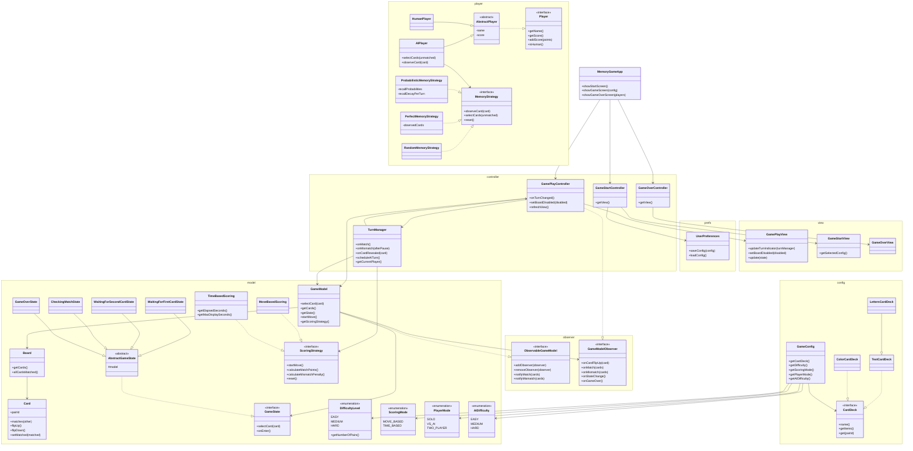

```mermaid
classDiagram
    direction TB

    class MemoryGameApp {
        +showStartScreen()
        +showGameScreen(config)
        +showGameOverScreen(players)
    }

    namespace controller {
        class GameStartController {
            +getView()
        }
        class GamePlayController {
            +onTurnChanged()
            +setBoardDisabled(disabled)
            +refreshView()
        }
        class GameOverController {
            +getView()
        }
        class TurnManager {
            +onMatch()
            +onMismatch(afterPause)
            +onCardRevealed(card)
            +scheduleAITurn()
            +getCurrentPlayer()
        }
    }

    namespace model {
        class GameModel {
            +selectCard(card)
            +getCards()
            +getState()
            +startMove()
            +getScoringStrategy()
        }
        class Board {
            +getCards()
            +allCardsMatched()
        }
        class Card {
            +pairId
            +matches(other)
            +flipUp()
            +flipDown()
            +setMatched(matched)
        }
        class GameState {
            <<interface>>
            +selectCard(card)
            +onEnter()
        }
        class AbstractGameState {
            <<abstract>>
            #model
        }
        class WaitingForFirstCardState
        class WaitingForSecondCardState
        class CheckingMatchState
        class GameOverState
        class ScoringStrategy {
            <<interface>>
            +startMove()
            +calculateMatchPoints()
            +calculateMismatchPenalty()
            +reset()
        }
        class MoveBasedScoring
        class TimeBasedScoring {
            +getElapsedSeconds()
            +getMaxDisplaySeconds()
        }
        class DifficultyLevel {
            <<enumeration>>
            EASY
            MEDIUM
            HARD
            +getNumberOfPairs()
        }
        class ScoringMode {
            <<enumeration>>
            MOVE_BASED
            TIME_BASED
        }
        class PlayerMode {
            <<enumeration>>
            SOLO
            VS_AI
            TWO_PLAYER
        }
        class AIDifficulty {
            <<enumeration>>
            EASY
            MEDIUM
            HARD
        }
    }

    namespace observer {
        class ObservableGameModel {
            <<interface>>
            +addObserver(observer)
            +removeObserver(observer)
            +notifyMatch(cards)
            +notifyMismatch(cards)
        }
        class GameModelObserver {
            <<interface>>
            +onCardFlipUp(card)
            +onMatch(cards)
            +onMismatch(cards)
            +onStateChange()
            +onGameOver()
        }
    }

    namespace player {
        class Player {
            <<interface>>
            +getName()
            +getScore()
            +addScore(points)
            +isHuman()
        }
        class AbstractPlayer {
            <<abstract>>
            -name
            -score
        }
        class HumanPlayer
        class AIPlayer {
            +selectCards(unmatched)
            +observeCard(card)
        }
        class MemoryStrategy {
            <<interface>>
            +observeCard(card)
            +selectCards(unmatched)
            +reset()
        }
        class ProbabilisticMemoryStrategy {
            -recallProbabilities
            -recallDecayPerTurn
        }
        class PerfectMemoryStrategy {
            -observedCards
        }
        class RandomMemoryStrategy
    }

    namespace config {
        class CardDeck {
            <<interface>>
            +name()
            +getItems()
            +get(pairId)
        }
        class GameConfig {
            +getCardDeck()
            +getDifficulty()
            +getScoringMode()
            +getPlayerMode()
            +getAIDifficulty()
        }
        class ColorCardDeck
        class LettersCardDeck
        class TextCardDeck
    }

    namespace prefs {
        class UserPreferences {
            +saveConfig(config)
            +loadConfig()
        }
    }

    namespace view {
        class GamePlayView {
            +updateTurnIndicator(turnManager)
            +setBoardDisabled(disabled)
            +update(state)
        }
        class GameStartView {
            +getSelectedConfig()
        }
        class GameOverView
    }

    %% App orchestration
    MemoryGameApp --> GameStartController
    MemoryGameApp --> GamePlayController
    MemoryGameApp --> GameOverController

    %% Controller relationships
    GamePlayController --> GameModel
    GamePlayController --> TurnManager
    GamePlayController --> GamePlayView
    GameStartController --> GameStartView
    GameStartController --> UserPreferences
    GameOverController --> GameOverView
    TurnManager --> GameModel
    TurnManager --> ScoringStrategy
    TurnManager --> GamePlayController

    %% Observer pattern
    GameModel ..|> ObservableGameModel
    GamePlayController ..|> GameModelObserver
    GameModel --> GameModelObserver

    %% State pattern
    GameModel --> GameState
    AbstractGameState ..|> GameState
    WaitingForFirstCardState --|> AbstractGameState
    WaitingForSecondCardState --|> AbstractGameState
    CheckingMatchState --|> AbstractGameState
    GameOverState --|> AbstractGameState

    %% Scoring strategy pattern
    MoveBasedScoring ..|> ScoringStrategy
    TimeBasedScoring ..|> ScoringStrategy

    %% Player hierarchy
    AbstractPlayer ..|> Player
    HumanPlayer --|> AbstractPlayer
    AIPlayer --|> AbstractPlayer
    AIPlayer --> MemoryStrategy
    ProbabilisticMemoryStrategy ..|> MemoryStrategy
    PerfectMemoryStrategy ..|> MemoryStrategy
    RandomMemoryStrategy ..|> MemoryStrategy

    %% Card deck hierarchy
    TextCardDeck ..|> CardDeck
    ColorCardDeck ..|> CardDeck
    LettersCardDeck --|> TextCardDeck

    %% Model internals
    GameModel --> Board
    Board --> Card
    GameConfig --> CardDeck
    GameConfig --> DifficultyLevel
    GameConfig --> ScoringMode
    GameConfig --> PlayerMode
    GameConfig --> AIDifficulty
```
