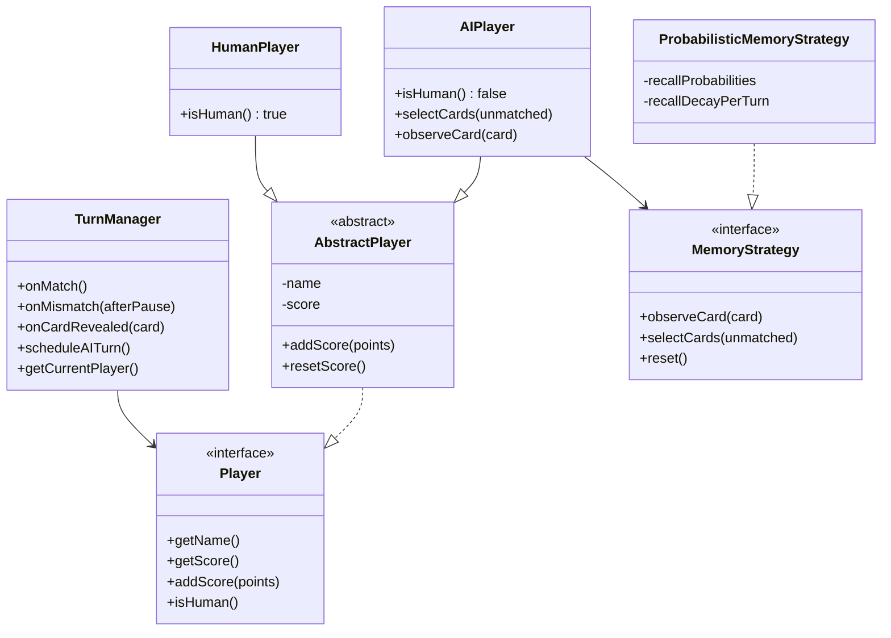
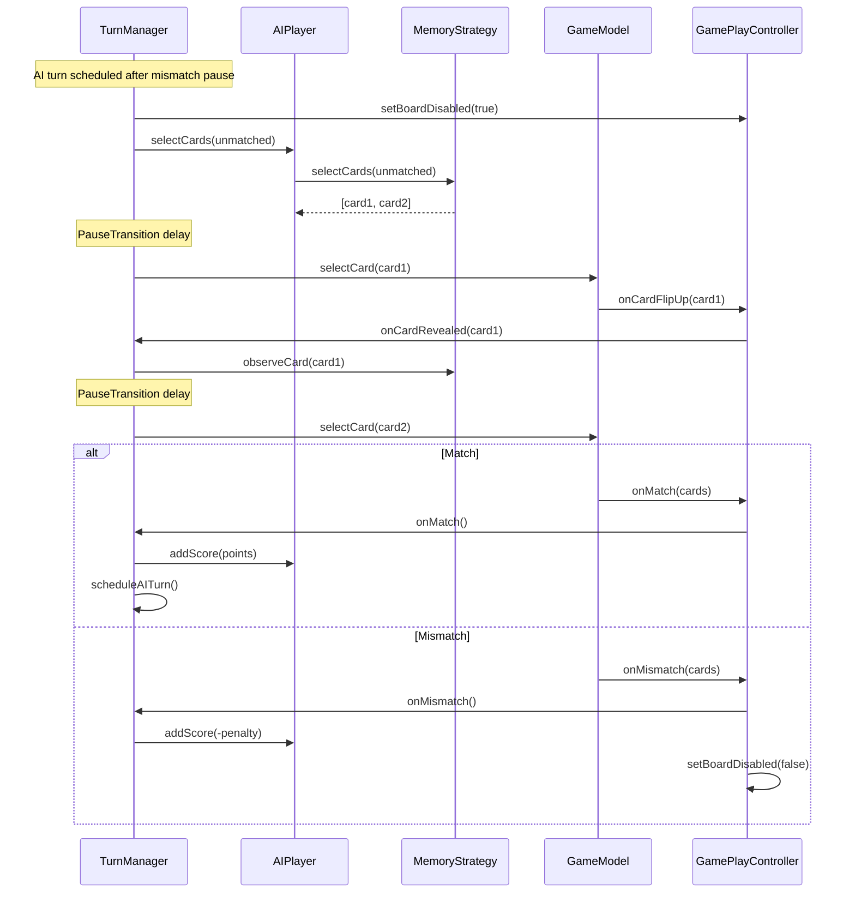

```mermaid
classDiagram
    class TurnManager {
        +onMatch()
        +onMismatch(afterPause)
        +onCardRevealed(card)
        +scheduleAITurn()
        +getCurrentPlayer()
    }

    class Player {
        <<interface>>
        +getName()
        +getScore()
        +addScore(points)
        +isHuman()
    }

    class AbstractPlayer {
        <<abstract>>
        -name
        -score
        +addScore(points)
        +resetScore()
    }

    class HumanPlayer {
        +isHuman() true
    }

    class AIPlayer {
        +isHuman() false
        +selectCards(unmatched)
        +observeCard(card)
    }

    class MemoryStrategy {
        <<interface>>
        +observeCard(card)
        +selectCards(unmatched)
        +reset()
    }

    class ProbabilisticMemoryStrategy {
        -recallProbabilities
        -recallDecayPerTurn
    }

    TurnManager --> Player
    AbstractPlayer ..|> Player
    HumanPlayer --|> AbstractPlayer
    AIPlayer --|> AbstractPlayer
    AIPlayer --> MemoryStrategy
    ProbabilisticMemoryStrategy ..|> MemoryStrategy
```

```mermaid
sequenceDiagram
    participant TM as TurnManager
    participant AI as AIPlayer
    participant MS as MemoryStrategy
    participant GM as GameModel
    participant GPC as GamePlayController

    Note over TM: AI turn scheduled after mismatch pause

    TM->>GPC: setBoardDisabled(true)
    TM->>AI: selectCards(unmatched)
    AI->>MS: selectCards(unmatched)
    MS-->>AI: [card1, card2]

    Note over TM: PauseTransition delay

    TM->>GM: selectCard(card1)
    GM->>GPC: onCardFlipUp(card1)
    GPC->>TM: onCardRevealed(card1)
    TM->>MS: observeCard(card1)

    Note over TM: PauseTransition delay

    TM->>GM: selectCard(card2)

    alt Match
        GM->>GPC: onMatch(cards)
        GPC->>TM: onMatch()
        TM->>AI: addScore(points)
        TM->>TM: scheduleAITurn()
    else Mismatch
        GM->>GPC: onMismatch(cards)
        GPC->>TM: onMismatch()
        TM->>AI: addScore(-penalty)
        GPC->>GPC: setBoardDisabled(false)
    end
```
