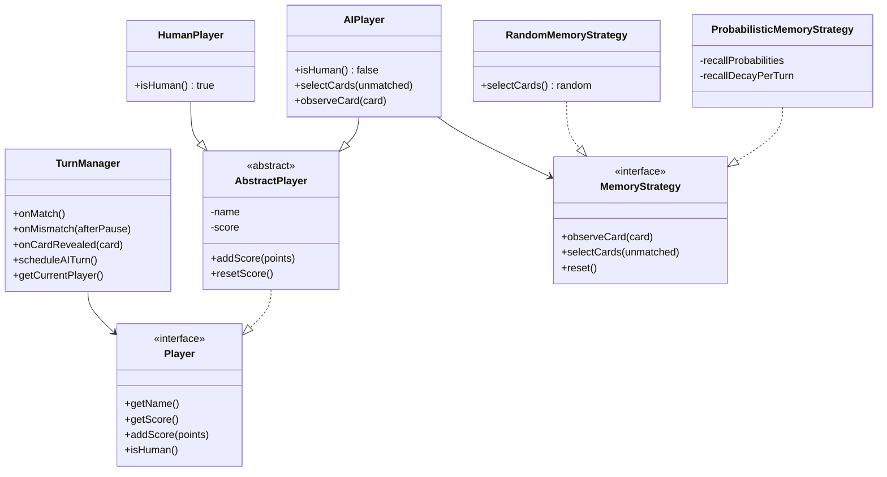

```mermaid
classDiagram
    class TurnManager {
        +onMatch()
        +onMismatch(afterPause)
        +onCardRevealed(card)
        +scheduleAITurn()
        +getCurrentPlayer()
    }

    class Player {
        <<interface>>
        +getName()
        +getScore()
        +addScore(points)
        +isHuman()
    }

    class AbstractPlayer {
        <<abstract>>
        -name
        -score
        +addScore(points)
        +resetScore()
    }

    class HumanPlayer {
        +isHuman() true
    }

    class AIPlayer {
        +isHuman() false
        +selectCards(unmatched)
        +observeCard(card)
    }

    class MemoryStrategy {
        <<interface>>
        +observeCard(card)
        +selectCards(unmatched)
        +reset()
    }

    class RandomMemoryStrategy {
        +selectCards() random
    }

    class ProbabilisticMemoryStrategy {
        -recallProbabilities
        -recallDecayPerTurn
    }

    TurnManager --> Player
    AbstractPlayer ..|> Player
    HumanPlayer --|> AbstractPlayer
    AIPlayer --|> AbstractPlayer
    AIPlayer --> MemoryStrategy
    RandomMemoryStrategy ..|> MemoryStrategy
    ProbabilisticMemoryStrategy ..|> MemoryStrategy
```
